# Overview:
* Created a tool that predicts and assigns a genre to a videogame in order to automate catalogs 
* Scraped over 20000 videogame descriptions from steam using python.
* Engineered features from the text of each videogame description to quantify the linguistic style used in the descriptions of different genres of videogames
* Utilized and compared severl classifiers using Scikitlearn.
* [Notebook Source Here](notebook.ipynb)

# Steam-Tag-Classification
Classification models have been used by retail stores to decide what category to assign to a product automatically. Methods to automatically classify products have helped businesses to improve the accuracy of the classification and, by effect, improve e-commerce performance.  In this project, I investigate the probabilistic and statistical principles behind Nieve Bay's Classification model. The concept of TF-IDF's is used to implement a classification model for videogames based on the description of the game. Variance analysis and ChiSquared hypothesis testing are also utilized for choosing features of each category. A simple model is implemented and obtained a 66% accuracy for 12 classes of videogames.

## Analysis
In this project, I produce a classification system to classify videogames by category. Each videogame has a description and categories, in text form. In most real applications of automatic classification, the system produces multiple tags or categories for each product, but for the sake of simplicity, the system predicts only one class for each game.

To complete my analysis and creation of the nieve Bay’s model, I used several python libraries. First I used the ‘pandas dataframe’ module to store my data in tables. I also use matplotlib to create my plots. Finally, I used scikit learn to implement the word count features, analysis of variance, and implementation of the Bay’s classifier. The first primary analysis was finding the distribution of videogame categories in the dataset. The number of classes and the number of game descriptions in the dataset was calculated first. There were 207 classes (genres), and 27334 games in the dataset. I also looked at all the tags in the 207 tags and found many were meaningless or obscure, so I chose to select 12 distinct types of games. After choosing only games within this category, there were 11297 games in the dataset. A distinct numerical ID was also assigned to each category of videogames.  A table containing the formatted data was created:

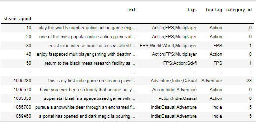

Next, the distribution of game categories was calculated to check what type of distribution fit. The system must treat this distribution of tags as independent from the probability that a videogame is a specific tag. The number of times a category was observed in the training data should not significantly affect the prediction of what kind of game it is. If the tags did not fit a uniform distribution, then more frequently observed tags would be wrongly classified more often and have a higher ‘weight.’ This is because the Bayes classifier uses prior probability P(Y). After plotting a bar graph of the number of games with tags vs. the number of classes, it was found that the distribution was not uniform, and the data had one type of game observed a lot more than others.

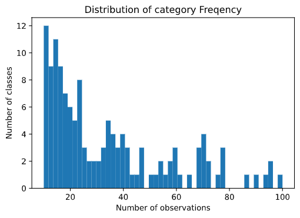

The second analysis I did was on the description text. I calculated the distribution of description lengths for each category. They all had about the same mean number of, so the length of the document would not be a words excellent feature to include in the classification.

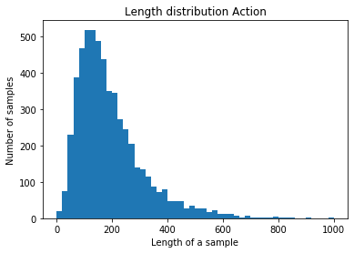
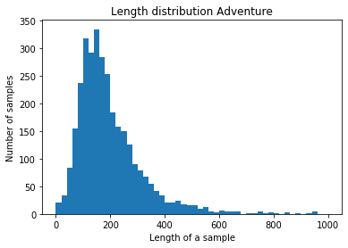
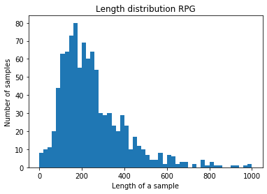
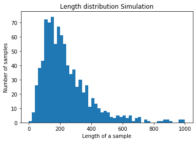

There was high variance in all word count distributions as well. This is a problem since longer descriptions naturally have higher word counts. The length of the document should not affect the X features of our data, so this length and word count needs to be normalized.

The system implements a Term Frequency Inverse Document Frequency (TF-IDF) calculation as X features instead of raw word counts to normalize the word counts. This calculation takes the number of observations of a word and divides it by the total number of words in the text. It then multiplies it by the inverse document frequency or the number of documents that word was observed. This causes unique words to be somewhat ‘weighted’ since words in fewer documents have a higher value assigned to them. This TF-IDF calculation fixes the issues with the length of description and improves the features by adding significance to unique words. The TF-IDF is calculated by: 

The next analysis I did was to investigate the top words in the descriptions and how to improve which words to use in the TF-IDF. I plotted the top 30 words by frequency on a bar graph to investigate the word types:
 
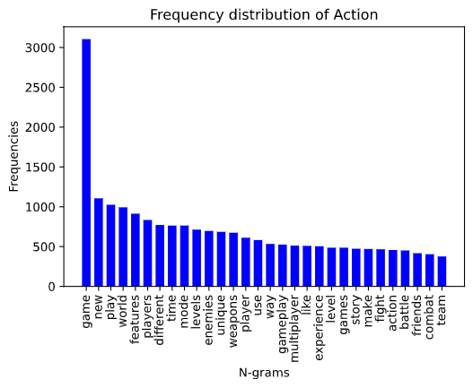
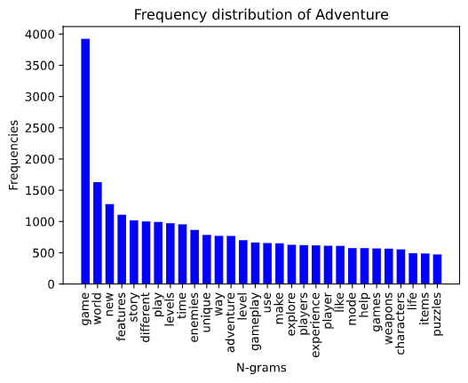
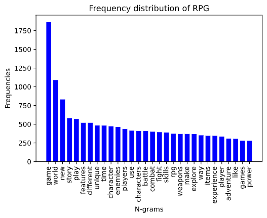
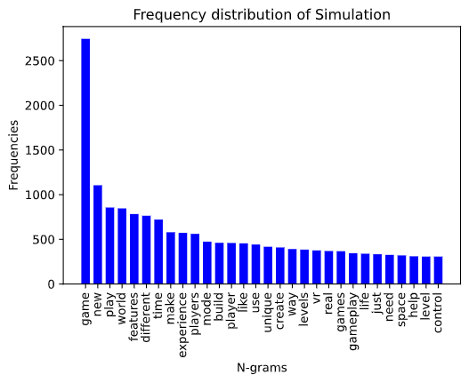

It was found that there was some variance in the word frequency for each type of game. This fits my hypothesis that different types of games have different frequencies of words used. This also shows some insight into what is essential to include in each genre of game. For example, since RPG games and Adventure games use the word ‘world’ the most, the world I an essential part of this genre of game. In contrast, based on the word frequencies, Action games put importance on the enemies in the game. 
Since each word or two-word combination was a ‘feature’ for each genre of game, there were hundreds of thousands of features for each class. There were as many features as observed words in the whole list of descriptions. Many of these features or words are not unique and do not contribute to the classification. The system utilized methods of feature reduction to simplify the number of features. Specifically, I chose to use a Chi-Squared test and an ANOVA test to find the best features or words that correlate to each class.  
A chi-squared test is a form of hypothesis testing. Chi-square tests measure dependence between variables, so using this function removes the words that are the most likely to be independent variables and, therefore, irrelevant for classification. I also tried a different method of feature extraction called an ANOVA F-test. It has the same effect as a chi-squared test, but it analyzes the variance in features to pick the words that have a high variance between each class. ANOVA is based on the law of total variance, which states the observed variance in a variable can be partitioned into components attributed to different sources of variation.
I used both tests to find words that correlated highly with each category. With the chi-squared test, games like action, the top words were ‘enemies’ and ‘shooter’ as expected. For survival, ‘thirst’ and ‘shelter’ were the top words, so the word selection generally worked as expected and chose the words that highly related to the game topic. The Chi-Squared test had issues choosing words that seemed not to fit the topic. For example, puzzle games’ top words included ‘i-pad.’ For this reason, I chose to use the ANOVA test since it seemed to perform better with selecting words. The following were the calculated ‘most related’ terms for each category based on the ANOVA tests.
## Creating the Model
I used the python library scikit-learn to implement the Bay's classifier. The first step in creating this model was splitting the data into test and training sets. I used a set of 20% for testing the accuracy of the model, and the rest for training the model. The data was in the TF-IDF format, as described before. After a set of TF-IDF and a separate list of the corresponding Classes were created for training, it was passed to the Naive Bay's classifier algorithm (to calculate the 𝑃(𝑌) and 𝑃(𝑋|𝑌) for each class Y). After the model was created, the training set was passed into the model and used to predict what category. The test prediction was then compared to the actual class assigned to each game in the testing set.  The accuracy of the classifier can be calculated by the percentage of correct classifications on the testing set. From this initial test, the Naive Bay's classifier had an average accuracy of 66.3%. With the 12 chosen classes, if a class was randomly assigned, it would be expected to be correct about 8% of the time, so 68% is a somewhat successful classifier.  
After measuring the average accuracy of the algorithm, a confusion matrix chart was created to see which classes were being misclassified. The number of correct and incorrect predictions are summarized with count values and broken down by each class. Correct classification is along the diagonal of the matrix, and any classification not on the diagonal would be misclassified. Classification quality was not equal between each category.  
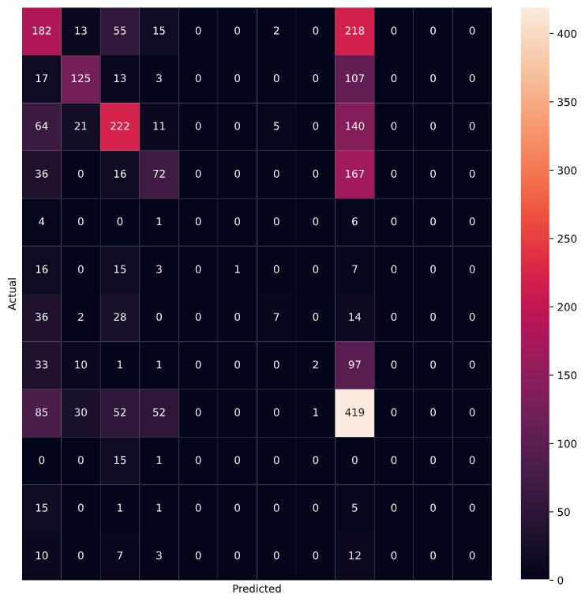
 
The Confusion matrix shows that a majority of games were categorized as action or adventure since a majority of observed classes were action or adventure. The Bay's classifier assigned a high probability to these classes since P(Y) for these classes was higher than other classes. This worked well on my particular test set since the test set had the same distribution of game categories. On a separate set, such as games from another website, this classifier may misclassify many games as action. The effect of class distribution can be modified to have less impact on the classification outcome by changing the training set distribution of classes. Fitting the number of classes to fit a uniform distribution would cause the P(Y) to be equal for all classes Y. For the Steam Store dataset, fitting the classes to a uniform distribution would be challenging due to the high variance in the number of observations for each class. I also compared the performance of nieve Bay's classifier to the performance of other algorithms. I plotted a bar chart of the accuracy of each algorithm. It was found that, as expected, nieve Bay's was not the most effective algorithm. Despite this, the Bay's classifier was a simple yet effective method of classification. 
This accuracy could be improved in several ways. In this project, our training and testing used data from only a single market. The algorithm could be made more robust by including data from more sources. Test data from a broader source would provide a better generalization of videogame descriptions and categories. Additionally, our algorithm could have considered features other than the product description text when classifying products. For example, we could have used product price or player count as a feature. Furthermore, classification algorithms that don't consider the number of observances in test data would better fit the goal of this project. Despite the issues with the Bay's classifier, the system was able to classify videogames by the words used in the description. 
